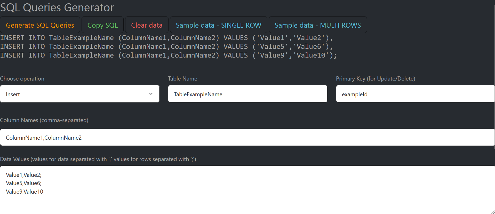

# SQL Queries Generator
## About
Put your data in the appropriate labels and generate SQL code.
You could choose between - insert, update or delete.

## Content
- [How to run the app?](./README.md#how-to-run-the-app)
  - [Environment](./README.md#environment)
  - [Used technologies](./README.md#used-technologies)
  - [Database and data](./README.md#database-and-data)
  - [Run the app](./README.md#run-the-app)
- [License](./README.md#license)
- [Creation time](./README.md#creation-time)

## How to run the app?
### Environment
- Windows 11 Pro v22H2

### Used technologies
- Visual Studio Code
- Bootstrap Theme: Slate
- HTML
- CSS
- JavaScript

### Database and data
Click on this github page project and see example data to use.

### Run the app
Download files from github
```
git clone https://github.com/Susannnnnna/JS-SQLQueriesGenerator
```

To run locally this project open it in visual studio code or any other text editor.

## License
[MIT license](https://opensource.org/licenses/MIT)

## Creation time
4-5 h
